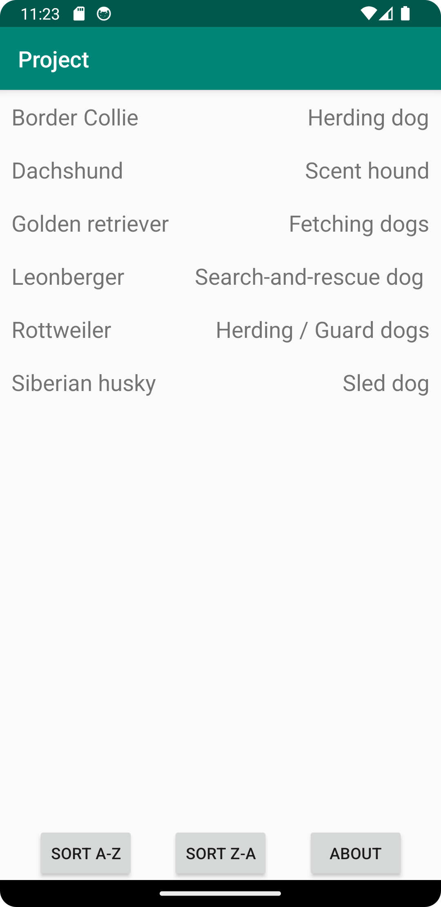

# Rapport

**App Project**

Denna app är till för att kunna vissa upp information från en databas. 

Myket av kåden I deta är kopierat från de gamla projekten.

Dog java classen är en vanlig java class som har elementen: name, origin, color, racialGroup, size,
cuteness och picture.
Dog classen är den som hållen infromationen om hundarna.

RecyclerViewAdapter classen är använd för att få recycler view att fungera.
RecyclerViewAdapter classen är stor dels kopierad från guiden på LenaSys för att få med 
OnClick funktionen. 
Det lades till två nya metoder till RecyclerViewAdaptern så det går att sortera recycler viewn.

```
public void sortAZ(){
    Collections.sort(items, new Comparator<Dog>() {
        @Override
        public int compare(Dog dog1, Dog dog2) {
            return dog1.getName().compareTo(dog2.getName());
        }
    });
}

public void sortZA(){
    Collections.sort(items, new Comparator<Dog>() {
        @Override
        public int compare(Dog dog1, Dog dog2) {
            return dog2.getName().compareTo(dog1.getName());
        }
    });
}
```

JsonTask är kopierad från guden och används för att hämta Json strängen.

Shared preference är bara använd i main activity för att hemta vilken sortering app ska ha.
Sorteringen sätts sedan i onPostExecute då det inte går i OnResume.

AboutActivity är about sidan och har endast en text view med lite text.

DetailActiviy är sidan som visar mer information om hundarna.
Denna sidans onclick liger på var sin hund i recycler view och skikar då den spesifika hundens 
information vidare. 

```
recViewAdapter = new RecyclerViewAdapter(this, listOfDogs, new RecyclerViewAdapter.OnClickListener(){
    @Override
    public void onClick(Dog dog) {
        Intent intent = new Intent(MainActivity.this, DetailActivity.class);
        intent.putExtra("name", dog.getName());
        intent.putExtra("origin", dog.getOrigin());
        intent.putExtra("color", dog.getColor());
        intent.putExtra("racialGroup", dog.getRacialGroup());
        intent.putExtra("size", dog.getSize());
        intent.putExtra("cuteness", dog.getCuteness());
        intent.putExtra("picture", dog.getPicture());
        startActivity(intent);
    }
});
```

I DetailActiviy hemtas sen intenet och sättre de på text viewsen.
Glide används här för att sätta bilden på image viewn då det är en länk som skikas med intent.

```
Bundle extras = getIntent().getExtras();
if (extras != null) {
    String name = extras.getString("name");
    String origin = extras.getString("origin");
    String color = extras.getString("color");
    String racialGroup = extras.getString("racialGroup");
    int size = extras.getInt("size");
    int cuteness = extras.getInt("cuteness");
    String picture = extras.getString("picture");

    nameTextView.setText(name);
    raceTextView.setText(racialGroup);
    Glide.with(this).load(picture).into(dogImageView);
    cutenessTextView.setText(name + "s cuteness ranking is " + cuteness + "/10");
    colorTextView.setText("The colors that " + name + "s can come in is " + color);
    originTextView.setText(name + "s comes from " + origin + " originally");
    sizeTextView.setText("The max size that " + name + "s can get to is " + size + " cm");

}
```

Picture Main activity


Picture About activity


Picture Detail activity - Border collie

